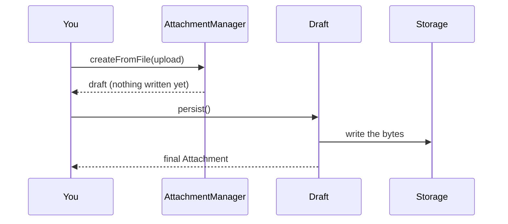
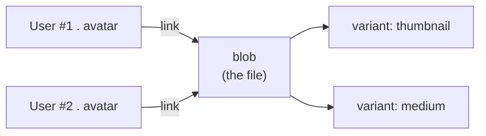
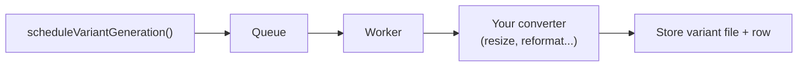

# Core concepts

Five ideas explain almost everything in the package. Read this once and the rest of the
guide will click.

## 1. The `Attachment` value

An `Attachment` is a plain, immutable object describing a stored file - `id`, `disk`,
`path`, `originalName`, `mimeType`, `size`, and optional `metadata`. It has **no database
coupling**: it's just data you can save anywhere and pass around freely.

## 2. Drafts and `persist()`

When you create an attachment from a source, you first get a **draft**. A draft looks like
an `Attachment` but **its bytes are not written yet**:

Why the two-step dance? So the caller (or an integration like Lucid) controls **exactly
when** the file hits storage - for example, only when the model is actually saved.

::: tip You rarely call persist() yourself with Lucid
The `@attachment()` and `@attachments()` relation decorators call `persist()` for you at
the right moment. You call it manually only in the
[custom persistence](/guide/custom-persistence) flow.
:::

## 3. Storage is a boundary

The package never talks to a filesystem or S3 directly. It talks to an **`AttachmentStorage`**
interface with three methods: `write`, `read`, `remove`. Three implementations ship:

- **`LocalFileStorage`** - writes to the local disk (the default).
- **`AdonisDriveStorage`** - delegates to Adonis Drive (S3, GCS, local...).
- **your own** - anything implementing the interface.

This is why switching from local files to S3 is a one-line config change.

## 4. Persistence is your choice

The package deliberately does **not** require Lucid. Two persistence paths are supported:

| Approach | When to use it |
| --- | --- |
| **Lucid relations** (`@attachment()` / `@attachments()`) | Database-backed ownership, collections, and variants. See [With Lucid](/guide/lucid). |
| **Custom** (any ORM / data store) | You keep the id, disk, path... in your own schema. See [custom persistence](/guide/custom-persistence). |

### The blob vs. link split (Lucid)

With relations, the package uses **two tables**, and understanding why makes everything
else obvious:

- **`attachments`** stores the **blob** - the actual file data. Originals *and* their
  image variants live here.
- **`attachment_links`** stores the **link** - the fact that *this record*, on *this
  field*, owns *that blob*.

Because many links can point to one blob, **the same file can be reused across records**
without copying it. A blob is deleted from storage only when its **last** link is removed
(reference counting). You opt into reuse explicitly with `attachExisting()` /
`addExisting()` - there's no surprise deduplication.

## 5. Variants happen out of band

A **variant** (a thumbnail, a resized image...) is generated from the original's bytes by a
**converter** you provide. Generation can run inline or through a queue, so a large upload
doesn't block the request:

See [Image variants](/guide/variants) and [Background processing](/guide/queues).

---

**Next:** [Configuration](/guide/configuration) to tune storage, defaults, and integrations.
