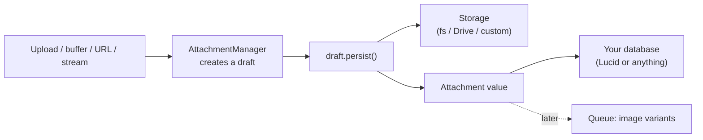

# Introduction

`@jrmc/adonis-attachment` handles a very common need in web apps: **a user gives you a
file, and you need to store it, remember where it is, sometimes resize it, and serve it
back later.**

What makes v6 different is that it keeps those four jobs **separate**, so you only pay for
the parts you use:

1. **Create** an attachment from whatever source you have (an upload, a buffer, a URL...).
2. **Store** its bytes on a disk (local filesystem, S3 via Drive, or your own backend).
3. **Persist** where it lives in your database (with Lucid, or any data store you like).
4. **Process** it in the background (generate image thumbnails, for example).

## The one value you need to know

Everything revolves around a single, plain, immutable value: the **`Attachment`**. It
just describes a stored file - no magic, no database coupling:

```ts
{
  id: '018f2a...',              // stable identifier
  disk: 'fs',                   // which storage backend
  path: 'users/42/018f2a....jpg', // where the bytes live on that disk
  name: '018f2a....jpg',
  originalName: 'profile.jpg',  // what the user called it
  mimeType: 'image/jpeg',
  extname: 'jpg',
  size: 34567,
  metadata: { /* optional, extensible */ }
}
```

Once you have an `Attachment`, you can save it wherever you want and read the file back
whenever you need it.

## How the pieces fit together



## What you need, and what's optional

| You want to... | You need |
| --- | --- |
| Store and read files | The package + a storage adapter (local FS works out of the box) |
| Store files on S3/GCS/... | `@adonisjs/drive` |
| Save files against database records (avatars, galleries...) | `@adonisjs/lucid` |
| Generate variants in the background | `@adonisjs/queue` (optional - an in-memory queue works too) |

Only AdonisJS Core is required. Everything else is opt-in.

## Where to go next

- **[Quickstart](/guide/getting-started)** - upload and display a file in five minutes.
- **[Core concepts](/guide/concepts)** - the mental model, in one page.
- **[Storing with Lucid](/guide/lucid)** - attach files to your models.
