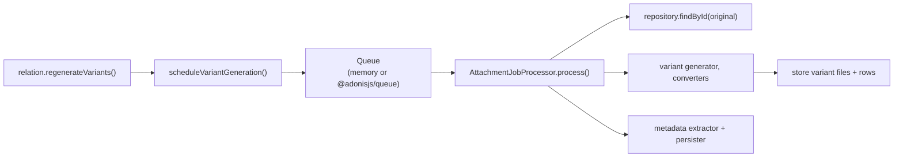

# Background processing

Generating variants can be slow, so the package runs it as a **job** off the request path.
`AttachmentService.scheduleVariantGeneration` emits a serializable `generate-variants` job;
a worker later resolves the original and runs your converters.

You choose how that job runs. Start with the in-memory queue and graduate to a real worker
when you need to.

## In-memory queue (default)

If you configure nothing, `MemoryAttachmentQueue` runs jobs **in the same process**. Give
it a `processor` and it will handle every job inline - great for development, tests, and
simple deployments.

```ts
import { defineConfig, LocalFileStorage } from '@jrmc/adonis-attachment'

export default defineConfig({
  storage: LocalFileStorage.fromApp,
  processor: attachmentProcessor, // an AttachmentJobProcessor
})
```

### Building the processor

`AttachmentJobProcessor` needs a repository (to load the original) and a variant generator.
Because the generator often needs `jrmc.attachment` from the container, you can pass it as
an **async factory** - it's resolved lazily on the first job, avoiding a boot-time cycle:

```ts
import {
  AttachmentJobProcessor,
  VariantGenerationService,
  attachmentConverters,
} from '@jrmc/adonis-attachment'
import {
  LucidAttachmentRepository,
  LucidAttachmentStore,
  LucidVariantGenerationService,
} from '@jrmc/adonis-attachment/lucid'

const processor = new AttachmentJobProcessor({
  attachments: new LucidAttachmentRepository(),
  metadata: {
    async extractAndPersistMetadata(attachment) {
      const attachments = await app.container.make('jrmc.attachment')
      await attachments.extractAndPersistMetadata(attachment)
    },
  },
  async variants() {
    const attachments = await app.container.make('jrmc.attachment')

    return new LucidVariantGenerationService({
      attachments,
      generator: new VariantGenerationService({ attachments, converters: attachmentConverters }),
      store: new LucidAttachmentStore(),
    })
  },
})
```

To emit lifecycle events from this worker, pass the same event adapter configured for the
package as `events`. See [Events](/guide/events#workers-and-external-queues).

## A real worker with `@adonisjs/queue`

For production, dispatch jobs to `@adonisjs/queue`. `AdonisAttachmentQueue` adapts your job
class to the package's queue interface:

```ts
import { AdonisAttachmentQueue } from '@jrmc/adonis-attachment'
import GenerateAttachmentVariants from '#jobs/generate_attachment_variants'

export default defineConfig({
  storage: LocalFileStorage.fromApp,
  queue: new AdonisAttachmentQueue({
    job: GenerateAttachmentVariants,
    queue: 'attachments',
  }),
})
```

Your job owns dependency injection and simply forwards its payload to the processor:

```ts
import { Job } from '@adonisjs/queue'
import type { AttachmentJob } from '@jrmc/adonis-attachment'
import attachmentProcessor from '#services/attachment_processor'

export default class GenerateAttachmentVariants extends Job<AttachmentJob> {
  async execute() {
    await attachmentProcessor.process(this.payload)
  }
}
```

This keeps the package independent of how and where your workers are deployed. Variant jobs
contain an id and optional keys; metadata jobs also contain the serializable attachment target
but never its file bytes. The worker reads the stored file before extracting metadata.

## The flow at a glance



**Next:** [Storing with Lucid](/guide/lucid).
