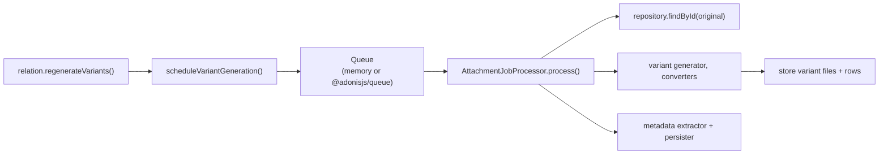

# Background processing

Generating variants can be slow, so the package runs it as a **job** off the request path.
`AttachmentService.scheduleVariantGeneration` emits a serializable `generate-variants` job;
a worker later resolves the original and runs your converters.

You choose how that job runs. Start with the in-memory queue and graduate to a real worker
when you need to.

## In-memory queue (default)

Pending jobs are not durable: a process restart loses them, and failed jobs are not
automatically retried. Use a persistent queue when those guarantees matter.

If you configure nothing, `MemoryAttachmentQueue` runs jobs **in the same process** - great
for development, tests, and simple deployments. When Lucid is detected, the package also
builds the processor automatically from the Lucid repository, configured converters, metadata
service, and variant store. Neither `queue` nor `processor` is required in that case.

The default concurrency is `1`; declare the memory driver only when you need to change it or
install a failure handler:

```ts
import { defineConfig, LocalFileStorage } from '@jrmc/adonis-attachment'

export default defineConfig({
  storage: LocalFileStorage.fromApp,
  queue: {
    driver: 'memory',
    concurrency: 2,
    onFailure(job, error) {
      console.error(`Attachment job ${job.type} failed`, error)
    },
  },
})
```

`onFailure` is called when the processor throws. It can be synchronous or asynchronous and
receives both the failed job and the original error. Without this callback, the in-memory queue
finishes the failed job silently, so production applications should report failures explicitly.

Outside Lucid, the package cannot infer how originals and generated variants are persisted.
Configure `processor` or `jobHandler` before scheduling a memory job; otherwise `enqueue`
rejects with `E_ATTACHMENT_PROCESSOR_NOT_CONFIGURED`. An explicit `processor` or `jobHandler`
also overrides the automatic Lucid processor.

### Creating the Lucid processor for a worker

An external worker does not use the memory queue's automatic processor. Create its processor
once in an application module with the Lucid-specific factory:

```ts
// app/attachments/lucid_processor.ts
import app from '@adonisjs/core/services/app'
import { createLucidAttachmentProcessor } from '@jrmc/adonis-attachment/lucid'

export default createLucidAttachmentProcessor(app)
```

The factory resolves the configured attachment service and converters lazily, and wires the
Lucid repository and variant store. Its name and import path make the persistence dependency
explicit. For another ORM, build a generic `AttachmentJobProcessor` with that ORM's repository
and variant persistence. To replace lifecycle events, pass `{ events }` as the second argument.
See [Events](/guide/events#workers-and-external-queues).

For a custom data store, see the complete
[variant persistence wrapper and processor](/guide/custom-persistence#generating-and-persisting-variants).

## A real worker with `@adonisjs/queue`

For production, dispatch jobs to `@adonisjs/queue`. `AdonisAttachmentQueue` adapts your job
class to the package's queue interface:

Install and configure the integration with `node ace add @adonisjs/queue`, then generate
the forwarding job with `node ace make:job generate_attachment_variants`. Complete the
queue driver's own connection and persistence setup before dispatching jobs.

```ts
import { defineConfig, LocalFileStorage } from '@jrmc/adonis-attachment'
import GenerateAttachmentVariants from '#jobs/generate_attachment_variants'

export default defineConfig({
  storage: LocalFileStorage.fromApp,
  queue: {
    driver: 'adonis',
    job: GenerateAttachmentVariants,
    queueName: 'attachments',
  },
})
```

Worker concurrency belongs to `@adonisjs/queue` and stays in its own worker configuration;
`queueName` is the default destination for Attachment jobs. A queue declared by the job takes
precedence, so the resolution order is:

1. `Job.options.queue`
2. Attachment's `queueName`
3. the native `default` queue from `@adonisjs/queue`

Omit `queueName` when every job should rely entirely on its own Adonis Queue configuration.

Your job owns dependency injection and simply forwards its payload to the processor:

```ts
import { Job } from '@adonisjs/queue'
import type { AttachmentJob } from '@jrmc/adonis-attachment'
import attachmentProcessor from '#attachments/lucid_processor'

export default class GenerateAttachmentVariants extends Job<AttachmentJob> {
  async execute() {
    await attachmentProcessor.process(this.payload)
  }
}
```

This keeps the package independent of how and where your workers are deployed. Variant jobs
contain an id and optional keys; metadata jobs also contain the serializable attachment target
but never its file bytes. The worker reads the stored file before extracting metadata.

Start a worker in another terminal, listening to the same queue as the configuration:

```sh
node ace queue:work --queue=attachments
```

Upload an original with `variants: ['thumbnail']`, then read the relation's `variants()`
after processing. A missing worker leaves jobs pending. The worker needs the same database,
storage access, configuration, optional media packages, and binary executables as the application.

## Instantiating the built-in queues directly

The named drivers are the shortest configuration, but both adapters can still be instantiated
directly. This is useful when you build the handler yourself or reuse the queue outside the
standard configuration factory:

```ts
import { MemoryAttachmentQueue, defineConfig, LocalFileStorage } from '@jrmc/adonis-attachment'
import attachmentProcessor from '#attachments/lucid_processor'

export default defineConfig({
  storage: LocalFileStorage.fromApp,
  queue: new MemoryAttachmentQueue({
    handler: (job) => attachmentProcessor.process(job),
    concurrency: 2,
  }),
})
```

```ts
import { AdonisAttachmentQueue, defineConfig, LocalFileStorage } from '@jrmc/adonis-attachment'
import GenerateAttachmentVariants from '#jobs/generate_attachment_variants'

export default defineConfig({
  storage: LocalFileStorage.fromApp,
  queue: new AdonisAttachmentQueue({
    job: GenerateAttachmentVariants,
    queueName: 'attachments',
  }),
})
```

With direct instantiation, you are responsible for wiring the memory queue's `handler`. The
Adonis adapter still only dispatches jobs; the job worker must invoke the processor as shown
above.

## Waiting for the memory queue in tests

When constructing a memory queue in a Japa test, retain the instance and await `drain()`
instead of waiting a fixed number of milliseconds:

```ts
import { test } from '@japa/runner'
import { MemoryAttachmentQueue } from '@jrmc/adonis-attachment'

test('processes an attachment job', async ({ assert }) => {
  const processed: string[] = []
  const failures: unknown[] = []
  const queue = new MemoryAttachmentQueue({
    handler: async (job) => {
      if (job.type === 'generate-variants') processed.push(job.attachmentId)
    },
    onFailure: (_job, error) => { failures.push(error) },
  })

  await queue.enqueue({ type: 'generate-variants', attachmentId: 'original-id' })
  await queue.drain()
  assert.deepEqual(processed, ['original-id'])
  assert.isEmpty(failures)
})
```

This tests queue execution only. To test actual conversion, use your processor as the
handler and assert the persisted variants after draining. `drain()` waits for completion
but does not rethrow job failures, so always capture and assert `onFailure` in such tests.

## Another queue library

The named drivers are conveniences for the built-in integrations. Any instance or application
factory implementing `AttachmentQueue` remains valid, so BullMQ, RabbitMQ, SQS, or another
transport does not require a new core driver:

```ts
export default defineConfig({
  storage: LocalFileStorage.fromApp,
  queue: (app) => new BullMqAttachmentQueue({
    connection: app.config.get('redis'),
  }),
})
```

```ts
interface AttachmentQueue {
  enqueue(job: AttachmentJob): Promise<void>
}
```

## The flow at a glance



**Next:** [Storing with Lucid](/guide/lucid).
